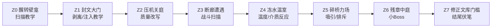

# 断句庭院灰盒流程

目标版本：MVP垂直切片  
预计时长：15到20分钟  
核心验证：玩家是否能自然理解扫描、剥离、注入、词缀替换和组合反应

## 1. 设计判断

断句庭院不是展示世界观宏大的场景，而是系统教学场。空间应短、密、可回看，玩家每次学到一个规则后，立刻遇到一个稍微变化的应用场景。

本关不做复杂支线，不做大范围回溯，不做因果闭环。所有谜题围绕10个MVP词缀展开。

## 2. 空间结构

## 3. 区域细化

### Z0 醒转壁龛

**目标**：让玩家学会扫描，不要求立刻改写。

**空间**：小型半圆壁龛，出口被远处封文大门挡住。地面有几块发光断句石。

**对象**：

- 断句石：只读对象，显示“缺页”但不可改写。
- 织叶仪残光：引导玩家长按扫描。

**教学节奏**：

1. 玩家醒来后，门不可直接互动。
2. 镜头和光线引导玩家看向门。
3. 扫描门时，只显示对象名和两个词缀：“封闭 / 坚固”。

**反思与优化**：  
不要在开场解释“世界由文字构成”。先让玩家看到门的状态，再用操作证明文字有用。

### Z1 封文大门

**目标**：完成第一次剥离和注入。

**对象**：

- 封文大门：封闭、坚固。
- 裂纹石像：脆弱。
- 备用石像碎片：防卡死用，玩家取走或打碎石像后仍提供脆弱。

**主解法**：

1. 扫描裂纹石像。
2. 剥离“脆弱”。
3. 扫描封文大门。
4. 注入“脆弱”替换结构槽。
5. 重击大门，大门破裂。

**旁路解法**：

- 如果玩家先打碎石像，碎片仍能剥离脆弱。
- 如果玩家误把脆弱注入非关键对象，门旁碎片会在20秒后重新显影脆弱。

**失败反馈**：

- 注入门以外对象时，如果槽位不匹配，显示“目标没有结构槽”。
- 没有选中词缀时尝试注入，显示“词库为空”。

**反思与优化**：  
第一次教学不放敌人。玩家要先相信规则，再把规则带进战斗。

### Z2 压机关庭

**目标**：教会质量槽替换，以及同一词缀在探索中的两种用途。

**空间**：小庭院中间有压机关石，机关板在右侧，出口栅门在前方。

**对象**：

- 压机关石：沉重。
- 浮字碑：轻盈。
- 地面机关：需要重量等级大于等于2。
- 出口栅门：由机关打开。

**主解法**：

1. 从浮字碑剥离“轻盈”。
2. 注入压机关石，让石头可被推动。
3. 推到机关板上。
4. 将“沉重”重新写回石头，压住机关。

**旁路解法**：

- 玩家可把沉重注入另一块小石堆，让小石堆承担机关重量。
- 玩家也可把轻盈注入自己附近的碎块，搭一个临时斜坡越过低墙。这个旁路只跳过半段，不跳过整个教学。

**防卡死**：

- 石头掉出区域时，重置拉杆把它传回初始点。
- 浮字碑每30秒恢复轻盈。

**反思与优化**：  
质量谜题必须让玩家用到“轻盈后移动，沉重后压住”两步。如果只让玩家把石头变轻推走，质量系统会显得像普通搬箱子。

### Z3 断廊遭遇

**目标**：把扫描和词缀改写引入低压战斗。

**空间**：窄走廊接小平台，保证敌人数量可控。

**敌人**：

- 字壳游兵 x2。

**敌人状态**：

- 游兵A：坚固、追猎。
- 游兵B：脆弱、追猎。

**主解法**：

1. 玩家发现坚固游兵普通攻击伤害低。
2. 完美弹反或重攻击破防，打开语义破绽。
3. 剥离“坚固”或注入“脆弱”。
4. 击败敌人。

**旁路解法**：

- 玩家可把轻盈注入游兵，让它被重攻击击飞到断廊边缘。
- 玩家可用场景碎块卡位，但不能完全绕过战斗。

**反思与优化**：  
战斗扫描只显示两个关键词，不能把敌人的完整配置表弹出来。这里验证UI节奏比验证战斗深度更重要。

### Z4 冻水温室

**目标**：教会温度槽、介质槽和第一个组合反应“蒸汽爆发”。

**空间**：中央是冻结水池，左侧火盆，右侧潮湿石板，前方有被冰封的升降台。

**对象**：

- 冻结水池：冻结、潮湿。
- 火盆：过热，温度槽锁定但可提供词缀。
- 冰封升降台：冻结。
- 字壳游兵 x1 或缀刺兽 x1，根据测试难度决定。

**主解法**：

1. 从火盆剥离“过热”。
2. 注入冰封升降台，解除冻结。
3. 从水池剥离“潮湿”。
4. 在敌人或热石上组合“过热 + 潮湿”，触发蒸汽爆发。

**旁路解法**：

- 玩家可用冻结水池制造临时冰面通过局部断口。
- 玩家可用蒸汽云遮挡敌人视线，从侧路通过。

**失败反馈**：

- 把过热写入火盆会提示“温度槽被锁定，火盆会自动维持过热”。
- 把潮湿写入火盆提示“火源无法附着潮湿状态”。

**反思与优化**：  
“潮湿”单独不够兴奋，所以这里必须让它立刻接上蒸汽爆发。否则玩家会把它误解成弱词。

### Z5 碎桥力场

**目标**：教会吸引、排斥和力场震荡，同时验证物理碎片可读性。

**空间**：断桥两侧有两根力场柱，中间漂浮碎片。玩家需要形成短暂通路。

**对象**：

- 吸引力场柱：吸引。
- 排斥力场柱：排斥。
- 漂浮碎片：轻盈。
- 断桥机关：需要碎片进入三个锚点。

**主解法**：

1. 用吸引把碎片拉到桥中央。
2. 用排斥把碎片推入锚点。
3. 三个锚点稳定后生成临时桥面。

**旁路解法**：

- 触发力场震荡，直接把碎片冲入锚点。
- 把部分碎片改为沉重，使其不再被过度推走。

**防卡死**：

- 碎片掉落后从桥下乱码区域重新生成。
- 力场柱有手动重置按钮。

**反思与优化**：  
力场谜题最容易变成物理混乱。MVP只需要3到5块关键碎片，其余碎片可以是视觉装饰，不参与判定。

### Z6 残章中庭

**目标**：小Boss综合考核，验证战斗中语义改写是否真的必要。

**空间**：圆形中庭，四角分别是火盆、水池、力场柱和裂纹石碑。Boss中央激活。

**Boss**：残章守卫。

**阶段结构**：

1. 阶段一：坚固锁定。玩家无法直接改写结构槽，需要用环境反应打掉护文层。
2. 阶段二：沉重冲撞。玩家用轻盈削弱冲撞，或用排斥打断。
3. 阶段三：过热暴走。玩家用潮湿制造蒸汽爆发，打开最后破绽。

**胜利条件**：

- 三次破绽后，结构锁定解除。
- 玩家注入脆弱并重击，击败Boss。

**反思与优化**：  
Boss不是考验玩家背表，而是考验玩家是否知道“从环境取词反制状态”。每个阶段只突出一个问题。

### Z7 修正文库门槛

**目标**：结尾奖励和世界伏笔。

**内容**：

- 玩家进入安静室内，看到大量悬浮文本页。
- UI短暂显示“更高阶语法：未授权”。
- 远处出现“因果闭环”和“文明语系”的只读标记，但不解锁。

**反思与优化**：  
结尾只埋伏笔，不给新机制。MVP结束时玩家应该记住刚学会的东西，而不是被新名词分散注意。

## 4. 节奏目标

| 区域 | 目标时长 | 玩家学到的规则 |
| --- | ---: | --- |
| Z0 | 1分钟 | 扫描能读状态 |
| Z1 | 3分钟 | 剥离和注入 |
| Z2 | 3分钟 | 质量替换和用途切换 |
| Z3 | 3分钟 | 战斗破绽与语义改写 |
| Z4 | 4分钟 | 温度、介质和蒸汽反应 |
| Z5 | 3分钟 | 吸引、排斥和物理解谜 |
| Z6 | 5分钟 | 综合运用 |
| Z7 | 1分钟 | 叙事收束 |

总时长允许在18到23分钟之间浮动。若玩家首次测试普遍超过25分钟，优先删减Z5碎片数量，而不是删教学。

## 5. 灰盒验收

- 玩家不看外部说明也能完成Z1。
- 至少70%的测试玩家能在Z2说出“轻盈用于移动，沉重用于压住”。
- Z3中玩家至少触发一次语义破绽。
- Z4中玩家至少触发一次蒸汽爆发。
- Z5不能出现碎片永久丢失。
- Z6不能被纯普通攻击无脑打过。
